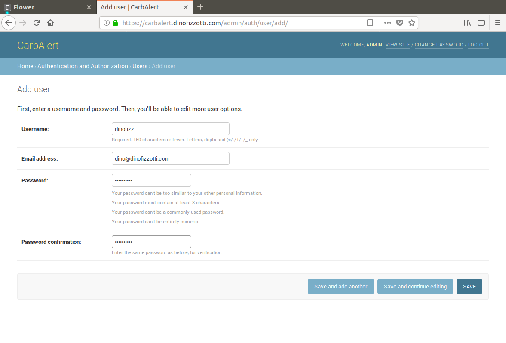
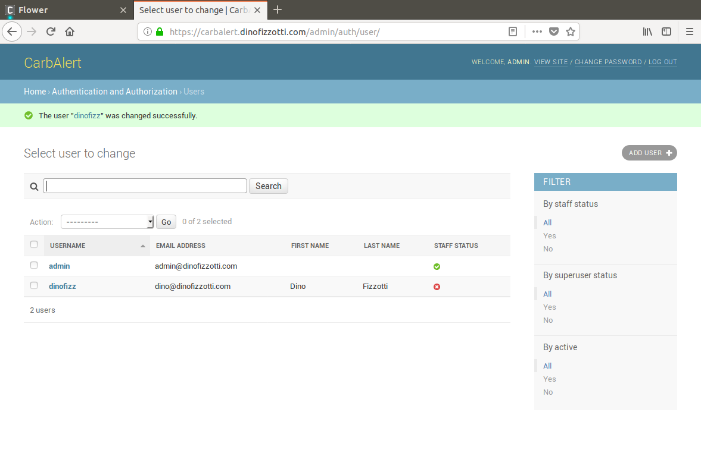
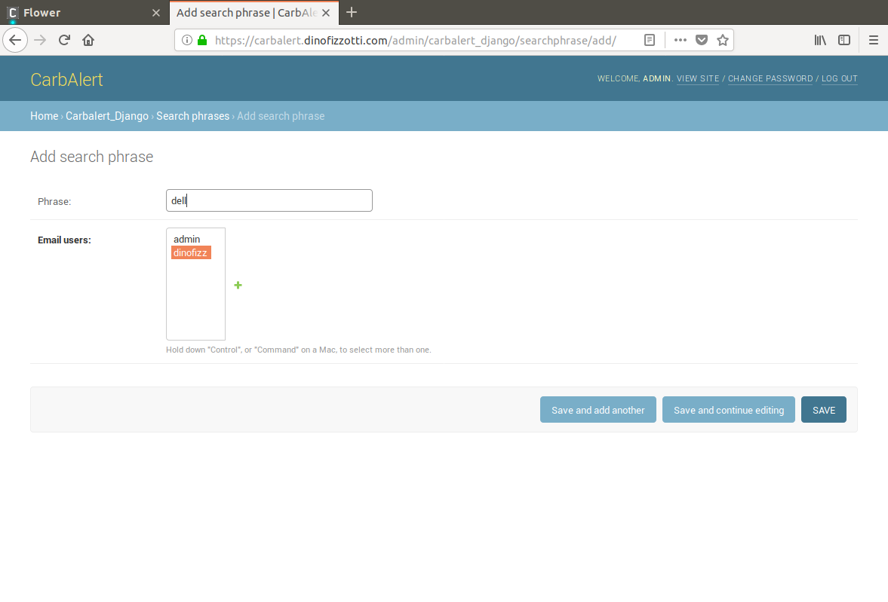

# CarbAlert

CarbAlert is a web application which scrapes a local (South African) second-hand computer parts forum for new posts offering laptops featuring keywords of interest (specifically the [first page of the "laptops" forum](https://carbonite.co.za/index.php?forums/laptops.32/)) I'm using [Django](https://www.djangoproject.com/) for the admin console and database/ORM integration, [Scrapy](https://scrapy.org/) for web-scraping, [Celery](http://www.celeryproject.org/) for task management, [Flower](https://flower.readthedocs.io/en/latest/) for task monitoring and [Mailgun](https://www.mailgun.com/) for sending out alert emails. I am using [Docker](https://www.docker.com/) to manage and run the containers which make up the CarbAlert application.


## Pre-requisites

For both local and production deployments you will need to register and obtain the relevant keys for access to the Mailgun API.

GitHub OAuth registration is required for production deployments where the Flower front-end is accessible over the internet.

### Mailgun registration

The email alerts are sent using the [Mailgun](https://www.mailgun.com) API. Mailgun will allow you to send up to 10000 emails a month before charging you - fine for development and testing.

To get started with Mailgun take a look at their docs. [Quick-start guide here](https://documentation.mailgun.com/en/latest/quickstart-sending.html#how-to-start-sending-email).

Once you have registered and set up your Mailgun "domain" you should be able to see and save the following values:

- Mailgun domain. I'm using "mg.dinofizzotti.com"
- Mailgun API key.

Keep these values on-hand, you will need them later during deployment.

### Flower / GitHub OAuth registration

CarbAlert uses [Flower](https://flower.readthedocs.io) as a front-end for inspectin the Celery tasks. I went with GitHub OAuth as an authentication mechanism (I don't want just anybody inspecting my Celery tasks). To get set up with GitHub OAuth start reading [here](https://flower.readthedocs.io/en/latest/auth.html#github-oauth).

Once you have completed the necessary steps to register an app you should note down the following values:

- OAuth2 key
- OAuth2 secret
- OAuth2 redirect URI

You will need these values later.

## Docker setup

### Pre-requisites

(I tested this on a fresh install of Ubuntu 18.04 and 18.10)

Make sure that you have an up-to-date version of:
 
* [Docker](https://store.docker.com/search?type=edition&offering=community)
* [Docker Compose](https://docs.docker.com/compose/install/)

### .env file for Docker Compose

The `docker-compose.yml` file requires certain environment variables to be present for deployment. I use a `.env` file for managing the environment variables. 

Here is an example of my `.env` file:

```bas## Note on optional Nginx container

In production I am running CarbAlert on a virtual private server (VPS) instance whose Nginx configuration I manage manually, so I have no need for a dedicated container running Nginx.

But I have included an "nginx" service in the docker-compose.yml file which will act as a reverse proxy for the Django and Flower web applications. This is most useful for local development and debugging as you will not need to install or setup Nginx on your host machine. However I have kept this service commented-out in the docker-compose.yml file. Un-comment the "nginx" service lines if you wish to run the Nginx container.
# Mailgun
MAILGUN_EMAIL=<insert the "from" email address for Mailgun mails here>
MAILGUN_API_KEY=<insert your Mailgun API key here>
MAILGUN_DOMAIN=<insert your Mailgun domain here>

# GitHub OAuth2
FLOWER_OAUTH2_EMAIL=<insert your OAuth2 GitHub email here>
FLOWER_OAUTH2_KEY=<insert your OAuth2 secret here>
FLOWER_OAUTH2_SECRET=<insert your OAuth2 secret here>
FLOWER_OAUTH2_REDIRECT_URI=<insert OAuth2 redirect URI here>
```

*Please note:* Existing environment variables available in your current terminal session will override those in the `.env` file.

## Launching CarbAlert

To build and run CarbAlert using Docker you will need to issue the following commands:

```bash
# Build and start the docker containers as described in docker-compose.yml
$ docker-compose up -d

# Generate the static content for the Django web admin portal
$ docker-compose exec web python manage.py collectstatic 

# Creates any necessary new migrations
$ docker-compose exec web python manage.py makemigrations 

# Apply the required migrations
$ docker-compose exec web python manage.py migrate

# Create a super user with which we can log into the Django admin portal
$ docker-compose exec web python manage.py createsuperuser
```

If all goes well you should be able to navigate to http://127.0.0.1/admin and see the CarbAlert admin login screen:


### Note on optional Nginx container

In production I am running CarbAlert on a virtual private server (VPS) instance whose Nginx configuration I manage manually, so I have no need for a dedicated container running Nginx.

But I have included an "nginx" service in the docker-compose.yml file which will act as a reverse proxy for the Django and Flower web applications. This is most useful for local development and debugging as you will not need to install or setup Nginx on your host machine. However I have kept this service commented-out in the docker-compose.yml file. Un-comment the "nginx" service lines if you wish to run the Nginx container.

## Using CarbAlert

What follows is a walk-through on how to add a user which will be receiving alerts on a newly added search term.

## Create a new user which will receive alerts

To create a new user for which search terms will be registered login with the admin user and navigate from the admin landing page to the "Users" admin page and then click the "Add user +" button on the top right. You will need to provide a username and the email address. This is the email address will be used when sending the alerts.





## Register a search term

To register a search term you need to navigate to the "Search phrases" page from the main admin landing page, and then select the "Add search phrase +" button on the top right. You need to enter a search term and select the user which will be receiving the alerts for this term.

In the screenshot below you can see that I am adding the search phrase "dell" (which is sure to give me a bunch of hits from the [Carbonite laptop forum](https://carbonite.co.za/index.php?forums/laptops.32/)):



That's it! Once the search term has been saved it will be included in the list of search phrases during the next execution of the Scrapy spider task. If there are any hits on this search term an email will be sent out to all associated users.
